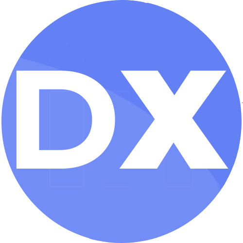

# PPE masks detection

This repo was created with the strong intention to improve and automate the safety processes in healthcare industry. DeepX team provides an object detection and tracking solution of a PPE masks detection using [Yolov5](https://github.com/ultralytics/yolov5) and [Norfair](https://github.com/tryolabs/norfair). Yolov5m model was trained on a custom dataset gathered by DeepX team, weights can be downloaded [here](https://drive.google.com/file/d/1BnSLhpNU3w2ifZtKuKwAMttbUnZXCU7W/view?usp=sharing). However, the solution can be applied for automating PPE detection processes in every industry or field. Let Computer Vision improve our world’s safety!
 
## Demo


## Installation
```
git clone --recurse-submodules https://github.com/deepxhubCV/ppe_masks_detection
cd ppe_masks_detection
pip install -r requirements.txt
```

## Inference
```
python track_masks.py --source $VIDEO_PATH --output_path $OUTPUT_PATH --weights $WEIGHTS_PATH
```

## Copyright

All licenses in this repository are copyrighted by their respective authors. Everything else is released under CC0. See [LICENSE](https://github.com/deepxhubCV/ppe_masks_detection/LICENSE) for details. 


## Contact 
For business or professional support requests please visit http://deepxhub.com/contact-us.

<div align="center">
 </a>
  
  <a href="https://www.linkedin.com/company/deepxhub">
    
 </a>
  
  <a href="http://deepxhub.com/">
    
  </a>
  
  <a href="https://www.youtube.com/channel/UC0iG-g0gtlOcazSc71VkyuA/videos">
    

